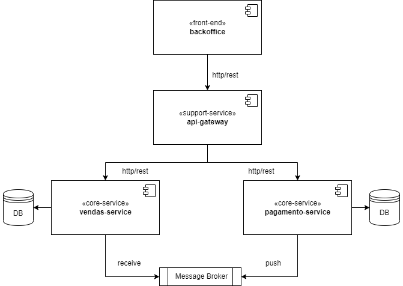

# Desafio Klok - Estágio em Desenvolvimento de Software

## Projeto Prático

  

### Requisitos

- Implementar uma API RESTFul capaz de:
  - Gerenciar vendas (cadastrar, atualizar e cancelar); e
  - Gerar cobranças para as vendas através de um job/scheduler configurável.
- Implementar uma segunda API RESTFul que deve:
  - Receber pagamentos via REST;
  - Se comunicar com o serviço de vendas via mensageria após o recebimento do pagamento para que a respectiva cobrança seja finalizada.
- As APIs deverão ser executadas através de containers Docker;
- Cada API deve ter seu próprio banco de dados e ambos deves ser executados via containers Docker;
- Os containers Docker devem ser orquestrados via docker-compose;
- Testes de unidade devem ser implementados;
- README com as especificações do projeto e os passos necessários para execução e testes.

### Tecnologias

- Java 8+;
- Spring Boot;
- Spring Data;
- Spring MVC;
- RabbitMQ ou Amazon SQS;
- PostgreSQL;
- Docker;
- Git.

### Diferenciais

- API Gateway;
- Front-end com Angular 9+;
- Autenticação com token JWT.

### Critérios de Avaliação

- Funcionamento;
- Consistência do modelo / aderência ao mundo real;
- Boas práticas de programação;
- Qualidade do código;
- Documentação;
- Testes.

### Instruções para Entrega

O projeto deve ser disponibilizado no GitHub contemplando as APIs, arquivos de configuração e outros que sejam necessário para a execução do mesmo.

Também deve ser adicionado o README contendo a documentação necessária para o correto entendimento e execução do projeto. Diagramas, tecnologias utilizadas e passo a passo para a execução do projeto e testes são itens importantes na documentação.

Após finalizado o link do projeto deve ser enviado por e-mail.

- **E-mail**: fagner.lima@klok.tech
- **Data limite**: 19/06/2023.

Qualquer dúvida podem entrar em contato por e-mail.
